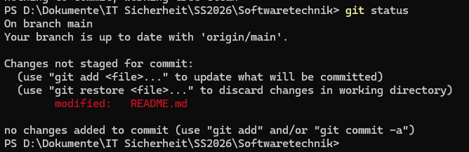
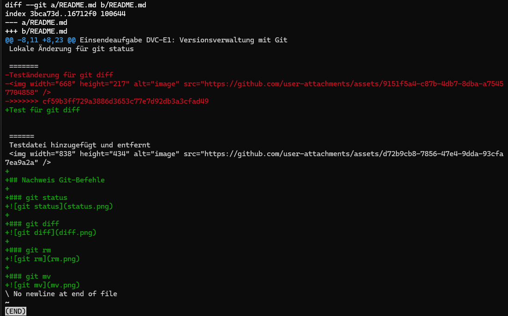
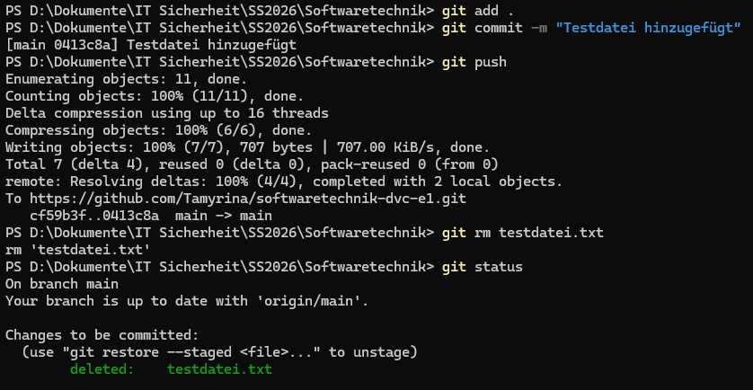
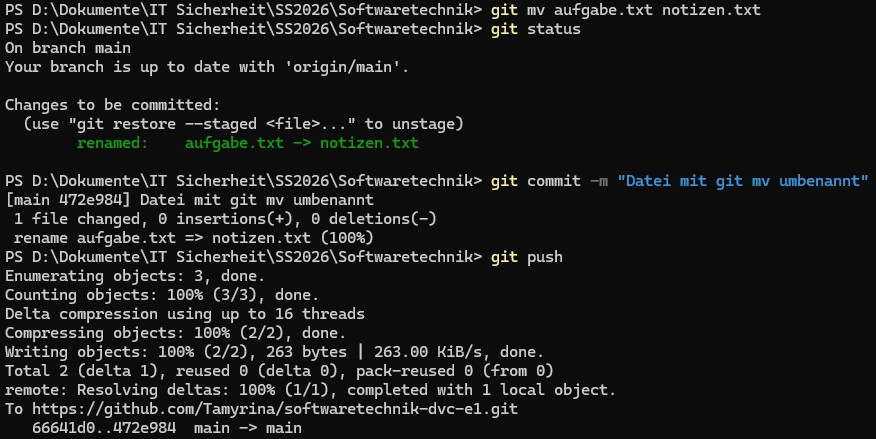
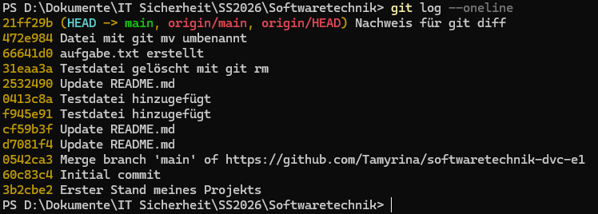
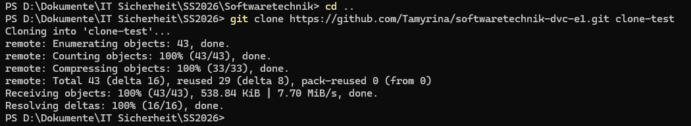
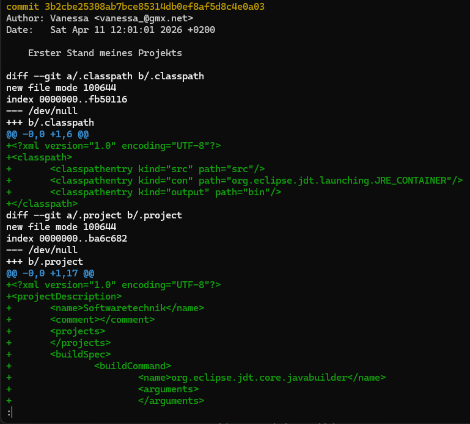
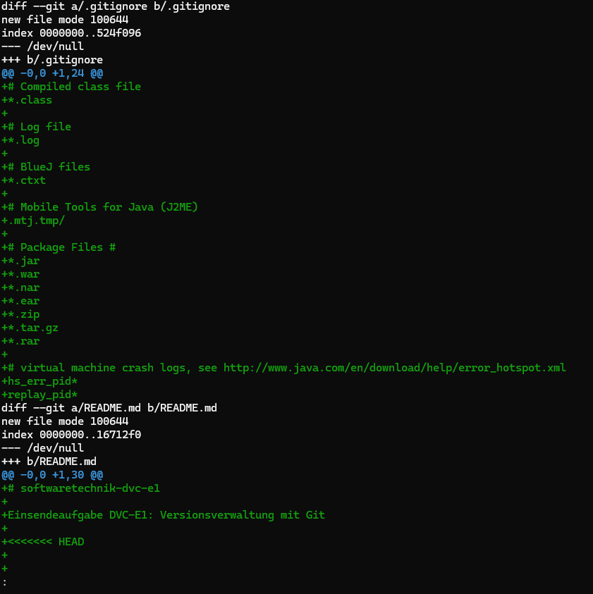
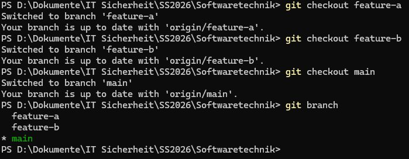

# softwaretechnik-dvc-e1

Einsendeaufgabe DVC-E1: Versionsverwaltung mit Git

Vanessa Fidorra
---

## Aufgabe 1: Repository erstellen
Ein öffentliches Repository wurde auf GitHub erstellt.

## Aufgabe 2: Projekt hochladen
Ein eigenes Projekt wurde erstellt und in das Repository gepusht.

---

## Aufgabe 3: Git-Methoden anwenden

Lokale Änderung für git status

Test für git diff

Die Änderungen und Versionsverläufe wurden mithilfe von Git-Befehlen nachvollzogen und dokumentiert.

### git status

### git diff

### git rm

### git mv

### git log

### git clone

---

## Aufgabe 4: Zeitreisen

Die Commit-Historie wurde analysiert und frühere Zustände betrachtet.

### git show (Zeitreise)

### git diff zwischen Commits

---

## Aufgabe 5: Branches und Merge

Es wurden zwei Branches (feature-a und feature-b) erstellt, zwischen ihnen gewechselt und anschließend wieder in den main-Branch gemerged.

### vorhandene Branches

---

## Aufgabe 6: Pull Request

Pull Request:
https://github.com/edlich/education/pull/572